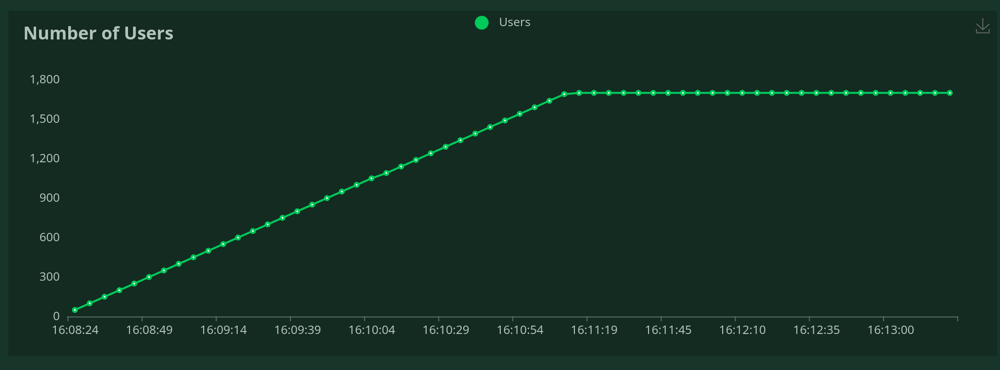

# Скринер валютных пар

Проект выполнен в рамках тестового задания


## Задание


**Реализовать сервис, через который можно получать курсы валютных пар с биржи**

Необходимо, чтобы сервис возвращал курсы по следующим валютным парам:
BTC-to-[RUB|USD]
ETH-to-[RUB|USD]
USDTTRC-to-[RUB|USD]
USDTERC-to-[RUB|USD]

**Требования:**
- FastAPI в качестве фреймворка и ассинхронная имплементация сервиса
- Использование очередей (RMQ, ZeroMQ, etc)
- Сервис может обработать до 1500 запросов в ед. времени
- Обновление курсов происходит не дольше чем раз в 5 секунд
- Сервис работает отказаустойчиво (если одна из бирж перестаёт возвращать курсы, то сервис продолжает работать по другой)
- Уровни логирования должны быть разделены на CRITICAL, ERROR, WARNING, INFO, DEBUG 
- Курсы необходимо получать c Binance, либо c coingeko. Разработанный API сервис при GET запросе на /courses c опциональными query параметрами, должен возвращать ответ формата 
```
  {
    "exchanger": "binance", 
    "courses": [
      {
        "direction": "BTC-USD",
        "value": 54000.000123
      }
    ]
  }
```
- Работа с биржей происходит по websocket’ам, если биржа это поддерживает
- Нагрузочное тестирование реализовать через locust. Скрины прикрепить в readme
- Необходимо реализовать версионирование API

**Сдача проекта:**
- Опубликовать проект необходимо в github
- Проект должен быть собран в docker контейнеры и в docker-compose файл. Для запуска проекта должно быть достаточно набрать команду `docker compose up --build`
- README заполнить информацией по запуску, заполнению секретов и прикрепить отчет о тестировании

**Будет плюсом:**
- Использование reverse proxy в качестве балансировщика запросов
- Использование postgres с автоматическим накатываением миграций
- Использование одного из популярных инструментов для кэширования
- FastAPI в качестве фреймворка и ассинхронная имплементация сервиса
- Использование метрик (grafana, kuma, etc)


## Описание

Приложение берет данные о валютных парах с API Binance и сохраняет их в базу данных.
Проект построен с использованием асинхронных технологий, что позволяет обрабатывать большое количество запросов.
Я не придумал, где можно использовать очереди в этом приложении.
Так же попытался реализовать обновление курсов валют в реальном времени с помощью вебсокетов, но не успел доделать.


## Переменные окружения

Заполнить переменные окружения в файле `.env_dist` и перемеименовать его в `.env`

## Запуск

```bash
docker-compose up -d --build
```
```bash
docker exec cource_backend alembic upgrade head
```


## Тестирование

Тестирование проводилось через Locust

```bash
locust -f locust/locustfile.py --host=http://localhost:8000 --headless -u 1700 -r 50
```

## Результаты тестирования


